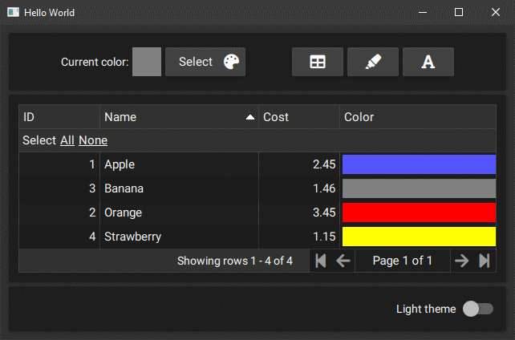
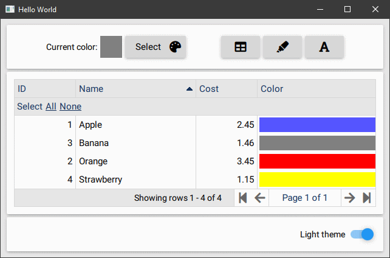
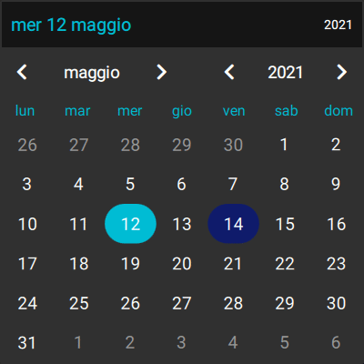
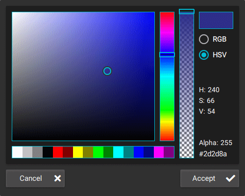
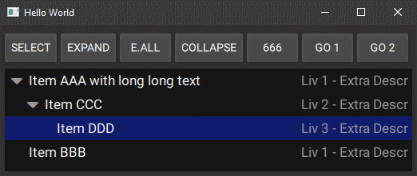

# Table of Contents

* [Introduction](#introduction)
  * [Requirements](#requirements)
  * [Component list](#component-list)
  * [Code Example](#code-example)
  * [Documentation/Wiki](#documentation-wiki)
  * [Changelog](changelog.md)
* [Examples](#examples)
  * [Examples folder](examples/README.md)
  * [Showcase](#showcase)

# Introduction

I started studying QML and realized that QT with QML is really well done, but I was missing some basic components. I started collecting them for myself and maybe they can be useful for someone. First I felt the need to have an easy-to-use grid component, so starting from TableView QML Type I modeled a new grid component on top of it. Then I continued adding Font Awesome icons and other usefull components.

`BppTable` is the grid component module

`BppFa` is a module that started to use Font Awesome in QML, later several UI components were added

## Requirements

Tested on Windows and Linux, Android 6+, may work on other plaftorms

Developed with Qt 5.12.3 (and 5.14.2)

### Warnings
QT >= 5.15 prints warning message ```QML Connections: Implicitly defined onFoo properties in Connections are deprecated.```, but this project cannot use the new syntax because it requires compatibility with Qt 5.12. Consider ``` QT_LOGGING_RULES="qt.qml.connections=false"```

## Component-list

List only usefull components

### `BppTable` Module

| Component | Description |
| --------- | ----------- |
| CompGrid | Grid component |
| CellButton | Button inside a grid cell |
| CellClicker | Handle mouse (or finger) interaction with cell |
| CellFa | Display a Font Awesome icon |
| CellText | Regular text cell |

### `BppFa` Module:

| Component | Description |
| --------- | ----------- |
| Fa (root context property) | Font awesome fonts and icons |
| BppMetrics | QML Singleton with UI parameter used in all other controls (Colors, Sizes, Fonts...) |
| BppButton | A Button with label and FA icon |
| BppCalendar | A Calendar box to select dates |
| BppTextDate | A text to show the date and open the calendar to change it |
| BppColorPicker | A Color Picker Pane (RGB/HSV) |
| BppColorPickerDialog | A popup dialog with BppColorPicker and Accept/Cancel |
| BppGrid | CompGrid styled with BppMetrics |
| BppGridFaIcon | FA icon with tooltip |
| BppGridText | CellText styled with BppMetrics |
| BppImageArrayChooser | A list images where only one can be selected, like Option Boxes with images |
| BppMsgBox | A Dialog to show a message to the user, modal or not |
| BppPane | A Pane styled with BppMetrics |
| BppShadowImageButton | A Button with image/text for big buttons in home page |
| BppStyleMaterial | Helper class for manage Material theme (Dark/Light) |
| BppStyleUniversal | Helper class for manage Universal theme (Dark/Light) |
| BppTextCp | A Text with some extra options and copy/paste button |
| BppToolButtonFa | A ToolButton for toolbars with FA icon |
| BppTreeView | Multi level TreeView component |

## Code-example

### How to start a new project

* in your project **.pro** add :
```
include($$PWD/bppgrid/BppTable.pri)
include($$PWD/bppgrid/BppFa.pri) #only if you plan to use FontAwesome 5 Icons
```
* in **main.cpp** call
```
bpp::TableModel::registerQml()
bpp::FontAwesome::registerQml(engine); //Optional
engine.addImportPath("qrc:/")
```
Example:
```
#include <bpptablemodel.h>
#include <bppfontawesome.h> //Optional

int main(int argc, char *argv[])
{
    QCoreApplication::setAttribute(Qt::AA_EnableHighDpiScaling);
    QGuiApplication app(argc, argv);
    QQmlApplicationEngine engine;
...
    bpp::TableModel::registerQml();
    bpp::FontAwesome::registerQml(engine); //Optional
    engine.addImportPath("qrc:/");
...
}
```

* in qml file add imports
```
import BppTable 0.1
```

* Use it!

### Example QML
```
import QtQuick 2.13
import QtQuick.Window 2.13
import BppTable 0.1

Window {
    visible: true
    width: 640
    height: 480
    title: qsTr("Hello World")

    property var fruitList: [
        {pkid: 1, name: "Apple", cost: 2.45},
        {pkid: 2, name: "Orange", cost: 3.45},
        {pkid: 3, name: "Banana", cost: 1.459},
        {pkid: 4, name: "Strawberry", cost: 1.1467}
    ];

    CompGrid {
        id: bGrid
        anchors.fill: parent
        anchors.margins: 10

        dataHeight: 30

        Component {
            id: cellItem

            Rectangle {
                implicitHeight: bGrid.dataHeight
                color: bGrid.getCellBk(row, highlight)

                CellText {
                    text: bGrid.formatDisplay(display, dataType, 2)
                    horizontalAlignment: bGrid.getAlign(dataType)
                }

                CellClicker {
                    grid: bGrid
                }
            }
        }

        cellDelegate: cellItem

        fromArray: [
            { role: "pkid", title: "ID", dataType: BTColumn.Int },
            { role: "name", title: "Name", minWidth: 100 },
            { role: "cost", title: "Cost", dataType: BTColumn.Dbl }
         ]
    }

    Component.onCompleted: {
        bGrid.fillFromJson(fruitList);
    }
}
```

## Documentation-wiki

IN PROGRESS

## Changelog

See [Changelog](changelog.md)

# Examples

See [examples folder](examples/README.md)

## Showcase






