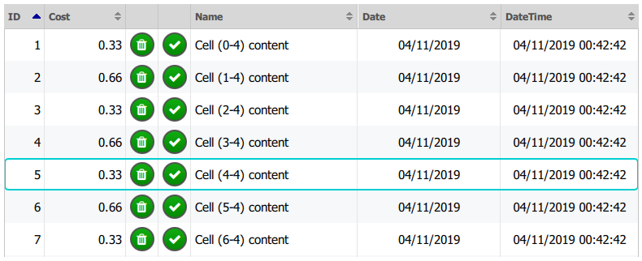

# bppgrid
QtQuick 2 Table component, modeled on TableView QML Type

Tested on Windows, Android 6+, may work on other plaftorms

Developed with Qt 5.13



### How to start a new project

* in (your) **project.pro** include pri:
```include($$PWD/../../bppgrid/bppgrid.pri)```
* in **main.cpp** register qml types:
```
#include <bpptablemodel.h>

int main(int argc, char *argv[])
{
    QCoreApplication::setAttribute(Qt::AA_EnableHighDpiScaling);
    QGuiApplication app(argc, argv);

...

    bpp::TableModel::registerQml();

...
}
```
* Use it!

### Example QML
```
import QtQuick 2.13
import QtQuick.Window 2.13
import BppTableModel 0.1

Window {
    visible: true
    width: 640
    height: 480
    title: qsTr("Hello World")

    property var fruitList: [
        {pkid: 1, name: "Apple", cost: 2.45},
        {pkid: 2, name: "Orange", cost: 3.45},
        {pkid: 3, name: "Banana", cost: 1.459},
        {pkid: 4, name: "Strawberry", cost: 1.1467}
    ];

    CompGrid {
        id: bGrid
        anchors.fill: parent
        anchors.margins: 10

        dataHeight: 30

        Component {
            id: cellItem

            Rectangle {
                implicitHeight: bGrid.dataHeight
                color: bGrid.getCellBackground(row)

                CellText {
                    text: bGrid.formatDisplay(display, dataType, 2)
                    horizontalAlignment: bGrid.getAlign(dataType)
                }

                CellSeparator{
                    color: bGrid.dataLines
                }

                CellClicker {
                    grid: bGrid
                }
            }
        }

        cellDelegate: cellItem

        columns: [
            { role: "pkid", title: "ID", dataType: BppTableModel.Int },
            { role: "name", title: "Name" },
            { role: "cost", title: "Cost", dataType: BppTableModel.Dbl }
         ]
    }

    Component.onCompleted: {
        bGrid.fillFromJson(fruitList);
    }
}
```

### Examples folder content

* Component preview: [bppgrid_preview.gif](examples/bppgrid_preview.gif)
* **simple**: very simple table, data loaded from Json
* **simple_array**: very simple table, data loaded from Js Array of records
* **simple_buttons**: 
  * auto size column
  * clickable cell
  * custom cell content (a ProgressBar)
* **fromDb**:
  * ```MyDatabase```
    * is a simple Class derived from ```bpp::TableDatabase```
    * ```bpp::TableDatabase::getDb()``` must provide a QSqlDatabase to internal data model, to fetch data
  * example SQLite Db is created in ```QStandardPaths::AppLocalDataLocation```
  * read data from a Db
  * Date/DateTime column
  * change column text

### Features
TODO: write list
